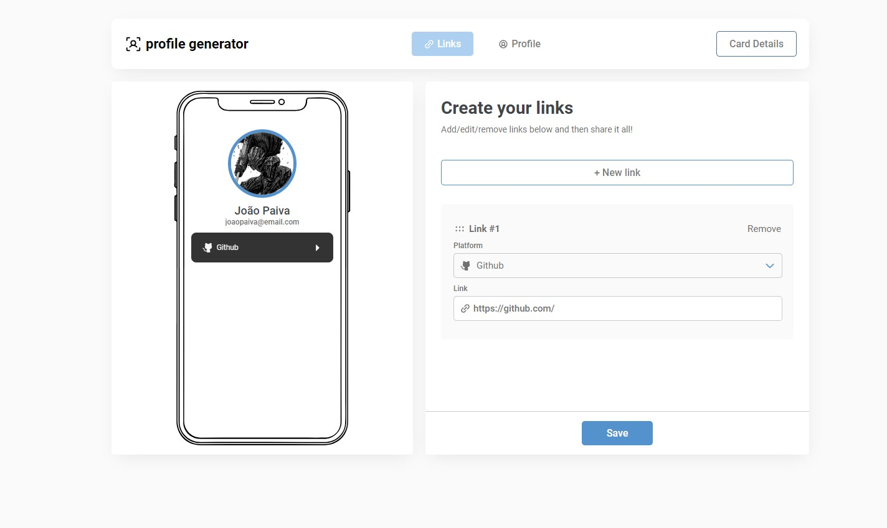
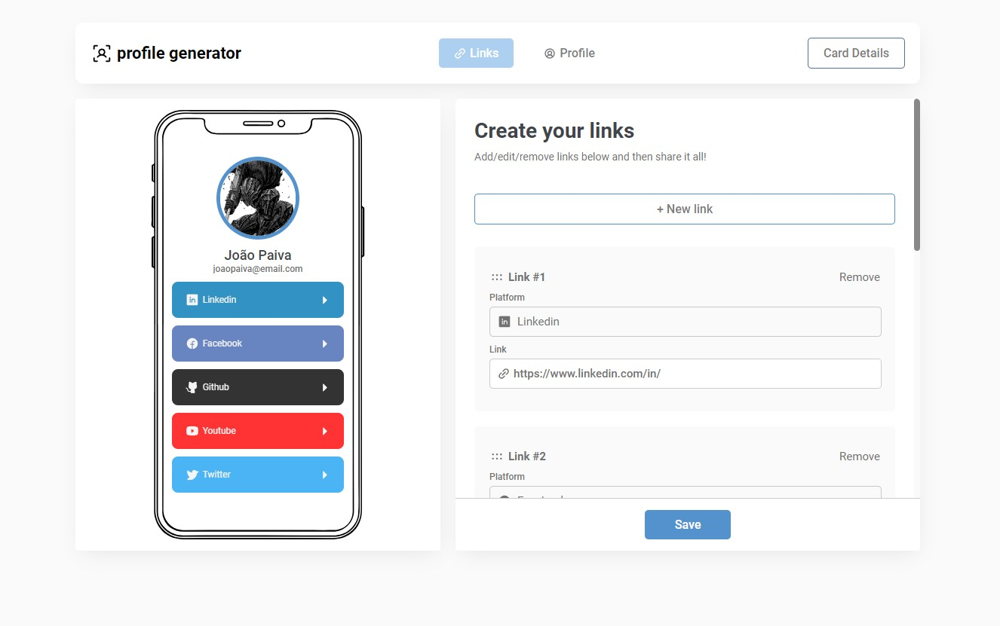
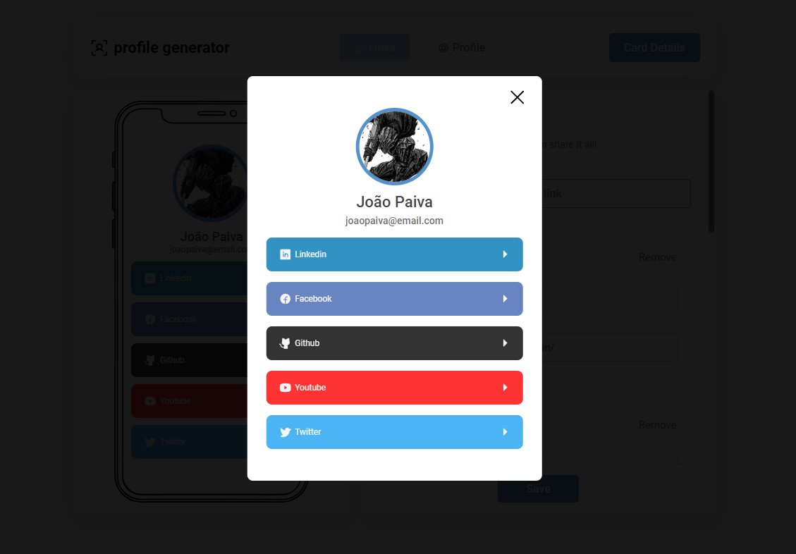
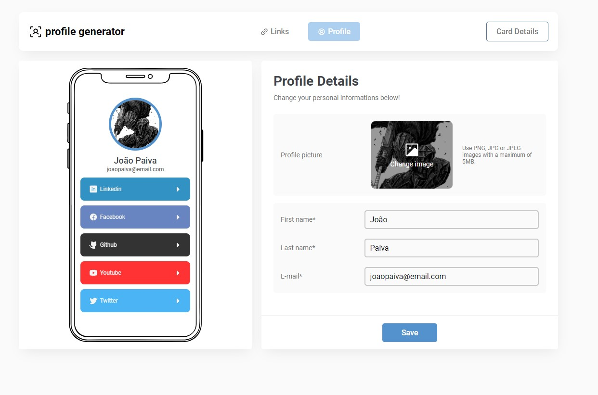

# Link-sharing app - recriation

This is a projet based on [Frontend Mentors](https://www.frontendmentor.io/challenges/linksharing-app-Fbt7yweGsT) "Link-sharing app" challenge.

## [Live Demo](https://card-profile-generator.netlify.app/)

## [Video demo](https://imgur.com/a/mpZihQq)

[Frontend Mentor](https://www.frontendmentor.io) challenges help you improve your coding skills by building realistic projects. These premium challenges are perfect portfolio pieces, so please feel free to use what you create in your portfolio to show others.

## Technologies Used

- TypeScript
- React;
- Styled components (CSS);

## Installation

```bash
$ npm install
```

## Running the app

```bash
$ npm run start
```

## The challenge

Your users should be able to:

- Create, read, update, delete links and see previews in the mobile mockup
- Receive validations if the links form is submitted without a URL or with the wrong URL pattern for the platform
- Drag and drop links to reorder them
- Add profile details like profile picture, first name, last name, and email
- Receive validations if the profile details form is saved with no first or last name
- Preview their devlinks profile and copy the link to their clipboard
- View the optimal layout for the interface depending on their device's screen size
- See hover and focus states for all interactive elements on the page

## Images






